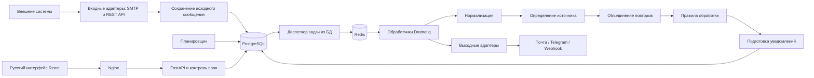

# Архитектура

Дополнительное обязательное требование —
[большой поток и большой архив событий](high-load.md). Оптимизации 0.10.1
не заменяют приёмку целевого потока на выбранном оборудовании.
Фактические контракты — [ingestion.md](ingestion.md),
[source-identification.md](source-identification.md) и [deduplication.md](deduplication.md).
Правила обработки и границы исполнения — [routing-and-simulation.md](routing-and-simulation.md).
Фактический состав стенда и команды — в [local-development.md](local-development.md).
Основа — модульный монолит с отдельными процессами приёма, фоновой обработки
и планирования. Backend: Python 3.12+, FastAPI, SQLAlchemy 2, Alembic, Pydantic;
PostgreSQL 16+ — источник истины. React, TypeScript и Vite — интерфейс,
Nginx — раздача локальных ресурсов и обратный прокси. Версии зависимостей
фиксируются и проверяются на этапе реализации, а не выбираются как «latest».

## Компоненты

Правила работают с общими событиями и создают намерения отправки. Они не
вызывают SMTP, Telegram или HTTP. Адаптер отправки получает подготовленный
снимок уведомления. Модули не обращаются к чужим таблицам в обход прикладного
слоя; общие транзакции обеспечиваются через единицу работы.

## Сохранность и фоновые задачи

Рекомендуются Dramatiq и Redis; обоснование и альтернативы — в
[ADR-001](adr/001-background-processing.md). В PostgreSQL хранится таблица
WorkItem: задача, due_at, состояние, аренда и число попыток. Задачи создаются
в одной транзакции с бизнес-данными. Redis передаёт только идентификаторы;
периодический диспетчер повторно публикует незавершённые задачи, поэтому
потеря брокера не равна потере принятого сообщения. Получатель блокирует и
проверяет задачу в БД. Окончание аренды допускает повторное исполнение.

Транзакции не удерживаются во время сетевого обмена. Доставка имеет семантику
«как минимум один раз» с документированными неоднозначными результатами.
Отложенная отправка, сводки и эскалация хранят сроки в БД, не в таймерах процесса.

## Интерфейс и локализация

Отдельные экраны: обзор, события, источники, правила, каналы уведомлений,
шаблоны, сводки, пользователи, журнал аудита, состояние системы и настройки.
Подробности — в боковой панели или отдельной странице. Не размещать все
настройки на одном длинном экране. Скрытые адаптеры исключаются из навигации
и вариантов выбора; администратор управляет ими в настройках адаптеров.

Слой `frontend/src/i18n` отделяет тексты от компонентов и машинных API-значений.
Единственный язык MVP — русский, без переключателя. Компоненты используют
типизированные ключи и форматтеры; расширение реестра языков не меняет страницы.
Обязательные тексты, статусы, ошибки и правила разработки определены в
[ui-language.md](ui-language.md). Внешние диагностические сообщения не
передаются в интерфейс напрямую.

## Границы MVP

SMTP и REST — вход; SMTP, Telegram и Webhook — выход. MAX не реализуется.
Syslog и отдельный входной Webhook описываются как расширения. Team закладывается
в схему и фильтрацию, но полноценная изоляция арендаторов не заявляется.
Приложение наблюдает за собой, не за внешней инфраструктурой.
Kubernetes, Kafka и Elasticsearch не требуются.

## Масштабирование

API и обработчики масштабируются горизонтально после нагрузочных измерений.
Планирование защищено блокировками БД и уникальными ключами выполнения.
Для нескольких узлов файловое хранилище заменяется общим через интерфейс BlobStore;
не монтировать независимые локальные каталоги под одним логическим именем.
Очереди приёма, отправки и обслуживания имеют отдельные лимиты параллелизма,
чтобы медленный канал не останавливал приём. PostgreSQL сначала обслуживается
индексами и очисткой; секционирование — отдельная будущая миграция.
