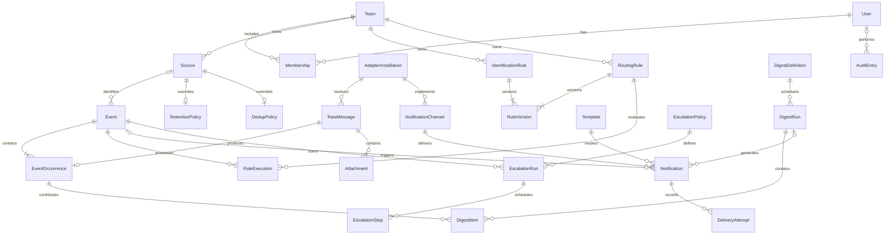

# Предлагаемая модель данных

Этап 6 добавляет `routing_rules` (условия, действия, приоритет, версия,
даты создания/изменения) и `rule_executions` (событие, поступление, версия,
индекс действия, область исполнения, неизменяемый результат). В `rule_versions`
поле `rule_id` стало допускающим null, добавлено `routing_rule_id`. Проверка
`ck_version_owner` требует ровно одного владельца; версии уникальны внутри
соответствующего правила. Старые версии сохраняют владельца и снимок.
Идемпотентность действий обеспечивает `uq_rule_effect`; индекс истории —
`ix_execution_occurrence`. Каналы, уведомления и эскалация добавлены этапами 7–9;
сводки остаются целевой моделью следующего этапа. [Контракт исполнения](routing-and-simulation.md).

Диаграмма ниже описывает целевую модель, включая ещё не выполненные этапы.
На этапе 5 миграция `0005` добавила `sources`, `identification_rules`,
`rule_versions`, `dedup_policies`, `dedup_keys`. У правила пока один владелец —
источник; версии относятся только к правилам определения источника.
Снимок версии хранит конфигурацию, автора и время изменения. В событии появились
`source_id`, `dedup_key_id`, категория, тип и метки; в поступлении —
`normalized_snapshot` и `rule_version_id`. Для существующих поступлений миграция
заполняет снимок из события, сохраняя статус и связи с исходным сообщением.
Область политики — `GLOBAL` или UUID источника внутри команды; уникальность
ключа повторов — команда, политика, её версия и отпечаток. Уникальный
`raw_message_id` защищает поступление от повторного учёта.

UUID — идентификаторы, timestamptz — время UTC. Настройки расписаний дополнительно
хранят часовой пояс IANA. Team обязателен для бизнес-сущностей; MVP создаёт одну
команду. Секреты хранятся зашифрованными или через ссылки на секретное хранилище.

## Поля и ограничения

| Сущность | Основные поля и ограничения |
| --- | --- |
| Team, User, Membership | имя команды; логин, password_hash, active; уникальные user_id/team_id и роль ADMINISTRATOR/OPERATOR/VIEWER |
| Session | user_id/team_id со ссылкой на Membership, hash токена, expires_at, revoked_at; сырой токен не хранить |
| LoginLimit | HMAC ключа имени или адреса, window_start, attempts; атомарный лимит попыток входа |
| AdapterInstallation | kind, direction, installed, enabled, visible, configured, health_status; конфигурация с версией схемы |
| Source | team_id, name, description, enabled; настройки хранения и повторов |
| RawMessage | team_id, input_adapter, received_at, sender, recipients, subject, text, sanitized_html, headers, blob_key, checksum, size, state, expires_at |
| Attachment | raw_message_id, безопасное отображаемое имя, content_type, size, checksum, blob_key; не доверять имени как пути |
| Event | team_id, nullable source_id, input_adapter, sender, subject, body, nullable severity, category, event_type, tags, metadata, status, received_at, first_seen_at, last_seen_at, occurrence_count, nullable raw_message_id, acknowledged_by/at, expires_at |
| EventOccurrence | event_id, nullable raw_message_id, received_at, normalized_snapshot; уникальный raw_message_id пока исходная запись существует, независимый ingest_id для идемпотентности |
| IdentificationRule, RoutingRule | team_id, name, description, enabled, priority, conditions, assignments/actions, version, created_at, updated_at |
| RuleVersion | один из identification_rule_id/routing_rule_id, version, immutable snapshot, changed_by/at; CHECK ровно одного владельца, уникальность версии внутри правила |
| RuleExecution | event_id, occurrence_id, rule_id, rule_version, action_index, result; уникальный ключ эффекта для повторного исполнения |
| NotificationChannel | team_id, adapter_id, name, enabled, config, encrypted_credentials, config_version |
| Template | team_id, name, kind, subject/body/html templates, version; отдельные неизменяемые версии |
| Notification | team_id, nullable event_id/digest_run_id, channel_id, template_version, prepared_payload, mode, status, due_at, attempt_count, max_attempts, failure_code, dead_lettered_at, lease_until, generation, idempotency_key, expires_at |
| DeliveryAttempt | notification_id, generation, attempt_number, started_at, finished_at, status, error_type, sanitized_error_message, request_id; уникальные notification_id/generation/attempt_number |
| WorkItem | team_id, kind, entity_id, UNIQUE team_id/dedupe_key, due_at, state, attempts/max_attempts, lease_until/token, publication_at/token, completed_at, failure_code |
| BlobRecord | team_id, непрозрачный id, STAGING/READY/DELETING/DELETED, checksum, size, owner_id/kind, created_at, deleted_at |
| StorageScan | одна служебная запись с номером группы файлов и курсором обхода |
| ComponentHeartbeat | component/instance_id, checked_at, status, безопасный code; текущие сигналы фоновых процессов |
| DigestDefinition | team_id, name, filter, schedule, timezone, period, channel_id, template_id, enabled, version |
| DigestRun, DigestItem | definition_id, window_start/end, definition_version, state; UNIQUE definition/window; run_id/occurrence_id UNIQUE |
| EscalationPolicy, EscalationRun, EscalationStep | версия и список каналов/задержек; event_id, policy snapshot, state; run_id, ordinal, due_at, notification_id, state, уникальные run_id/ordinal |
| RetentionPolicy | глобальная или source_id, сроки отдельно для событий, исходных сообщений, уведомлений, попыток, аудита, состояния и внутренних журналов |
| DedupPolicy, DedupKey | поля сравнения, window_seconds, version; team_id, policy_version, fingerprint UNIQUE в составе ключа, event_id, window_start/end |
| AuditEntry | timestamp, actor_id, team_id, action, entity_type/id, sanitized before/after, request_ip, request_id, expires_at |
| HealthSample | component_code, status, measured_at, safe metrics, expires_at |

Для сводок event_id пуст; для обычного уведомления digest_run_id пуст. Проверка
ограничивает происхождение уведомления одним вариантом. Полиморфные ссылки
WorkItem валидируются прикладным слоем; они не заменяют внешние ключи бизнес-таблиц.

## Индексы и удаление

Индексы: Event(team_id, received_at DESC, id), (team_id, source_id, received_at),
(team_id, status, received_at); частичный WorkItem(due_at) по незавершённым;
Notification(status, due_at), DeliveryAttempt(notification_id, started_at),
AuditEntry(team_id, timestamp), EventOccurrence(event_id, received_at),
expires_at/id на очищаемых таблицах. JSONB индексировать только по измеренным
запросам, не создавать универсальные GIN без необходимости.

Удаление исходного сообщения обнуляет ссылки, не удаляет событие. История
повторов сохраняется по сроку события. Завершённые уведомления содержат снимок
для независимого срока хранения. Родителей удалять после дочерних записей
ограниченными пакетами; активные задачи защищают нужные им данные.
Удаление источника с историей — деактивация, а не каскадная потеря событий.

## Переходы состояний

Событие: NEW → ACKNOWLEDGED/RESOLVED/SUPPRESSED; ACKNOWLEDGED → RESOLVED/SUPPRESSED.
Повторное подтверждение идемпотентно, первоначальный автор и время сохраняются.
Возврат в NEW не входит в MVP. SUPPRESSED запрещает будущие автоматические
отправки; уже начатый сетевой обмен остановить гарантированно нельзя.

Уведомление: PENDING/RETRYING → PROCESSING → SENT/RETRYING/FAILED.
PENDING/RETRYING/FAILED → CANCELLED. FAILED → PENDING при ручном повторе с новой
generation. SENT терминален. CANCELLED терминален; отдельная новая отправка
требует нового уведомления. Неопределённый результат попытки после аварии
помечается UNKNOWN; уведомление восстанавливается в RETRYING с предупреждением
о риске повторной доставки. Все пользовательские подписи — по ui-language.md.

## Фактическая схема этапа 4

Миграция `0004` добавляет шесть таблиц приёма и событий; поля описаны
в [ingestion.md](ingestion.md). `IngestCredential` привязан к команде,
хранит только хеш секрета, срок действия, отзыв и счётчик запросов.
`RawMessage` ссылается на оригинальный blob и адаптер, а для REST — на ключ.
Пара `(credential_id, idempotency_hash)` уникальна. `EventOccurrence.raw_message_id`
также уникален. Вложения имеют отдельные blob и безопасное отображаемое имя.
Состояния RawMessage: PENDING, NORMALIZED, LIMITED. Текст HTML не хранится как
готовая разметка: интерфейс получает только текстовое представление.

Таблица Source ещё не создана, API возвращает source_id=null; связь будет
добавлена на этапе 5. Версии правил, полные нормализованные снимки поступлений,
сроки хранения и настройки адаптеров из целевой модели вводятся на своих этапах.
`AdapterInstallation` пока хранит kind, enabled, visible и team_id; видимость
не влияет на возможность приёма. REST/SMTP установлены как модули текущего образа.

## Реализация доставки в миграции 0008

`notifications` хранит неизменяемую подготовку, снимок получателя, политику повторов
и собственное владение отправкой. `delivery_attempts` хранит каждую попытку
с отдельной серией, номером и безопасным кодом причины. `notification_operations`
обеспечивает идемпотентность ручных действий с привязкой к пользователю.
`work_items` вида `DELIVER` служат восстановимыми сигналами, а не владельцами
сетевой попытки. Детали и переходы — [в контракте](notification-delivery.md).

## Реализация действий и эскалации в миграции 0009

`escalation_policies`, `escalation_policy_versions`, `escalation_runs`,
`escalation_steps` и `event_actions` сохраняют настройки, версии, сроки и историю.
В `events` добавлены версия состояния, автор/время подтверждения и последнего
изменения; `notifications.escalation_run_id` связывает попытки с запуском.
[Транзакции, состояния и откат](event-actions-and-escalation.md).

## Реализация сводок в миграции 0010

Добавлены определения и их версии, снимки нормализованных поступлений, запуски
с сохранёнными границами/контрольной отметкой и состав. Уникальность окна
задаётся определением и обеими границами; состав уникален по запуску и поступлению.
Запуск имеет уникальную ссылку на обычное уведомление. Повторная обработка
не создаёт вторую отправку. [Контракт и ограничения](digest-runtime.md).
